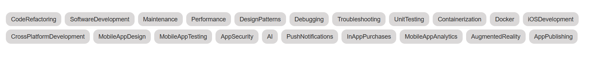
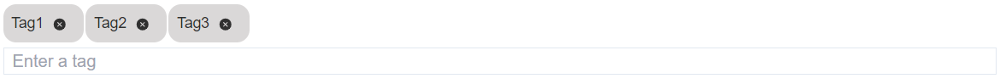
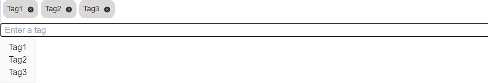
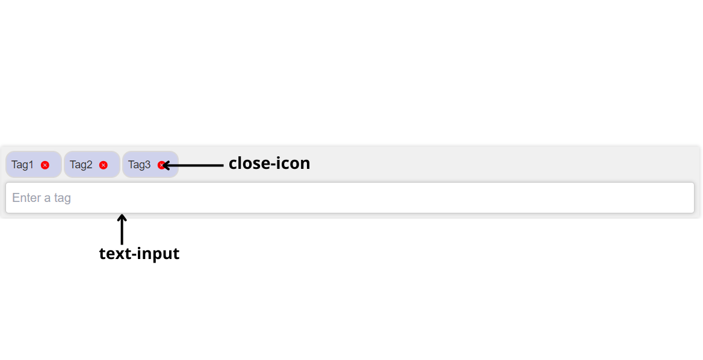
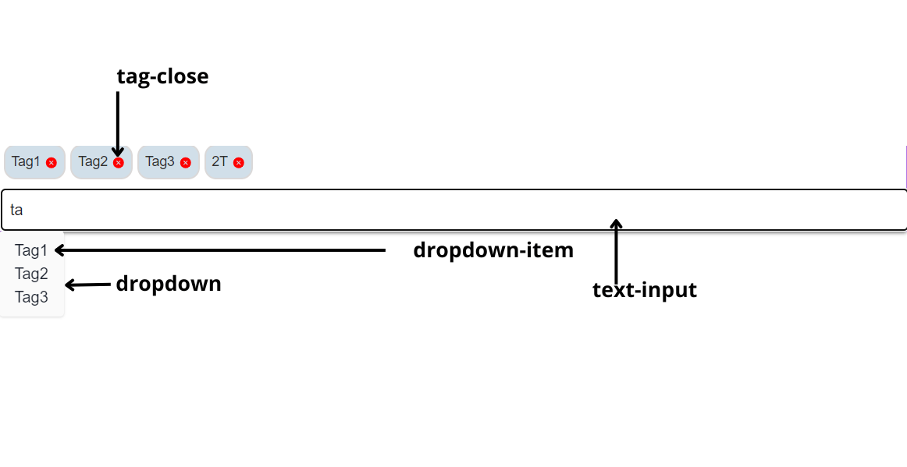

# Overview

Tags component for Qodly studio

## Tags

Customizable component for neatly displaying tags in a visually organized format.


## DataSource

| Name       | Type             | Description                                                                 |
| ---------- | ---------------- | --------------------------------------------------------------------------- |
| Datasource | Entity Selection | Entity Selection that serves as the source of data for the Tags components. |

## Properties

| Name  | Type   | Description                           |
| ----- | ------ | ------------------------------------- |
| field | string | property to represent the tag's name. |

## Tags input

Customizable input tags component to display tags in a neatformat allowing addition of new tags through an input.


## Select Tags input

Tags selector component provides a user-friendly way to manage and display tags, allowing users to input new tags, remove existing ones, and select from a dropdown of available tags.


## DataSource

| Name       | Type  | Description                                                      |
| ---------- | ----- | ---------------------------------------------------------------- |
| Datasource | Array | Array that serves as the source of data for the Tags components. |

```
Example of the data that can be used :
["tag1","tag2"]

```

## Properties

| Name       | Type    | Description                                             |
| ---------- | ------- | ------------------------------------------------------- |
| duplicated | boolean | Property indicating whether duplicated tags are allowed |
| max        | number  | Property indicating the maximum number of tags allowed  |

## Custom CSS

inputTagCss
When customizing the appearance of the tags, you have access to the following classes within the component:



```css
self {
box-shadow: 0 2px 4px rgba(0, 0, 0, 0.6);
}

/_ custom styles for the icon _/
self .tag-close {
cursor: pointer;
margin-left: 4px;
}

/_ custom styles for the text input _/
self .text-input {
width: 30%;
box-sizing: border-box;
border: 2px solid #ccc;
border-radius: 4px;
padding: 8px;
margin-left: 2px;
}
/_ custom styles for the dropdown _/
self .dropdown {
position: absolute;
top: 100%;
left: 0;
z-index: 1;
background-color: #f9f9f9;
border: 1px solid #999;
border-radius: 4px;
box-shadow: 0 2px 4px rgba(0, 0, 0, 0.4);
max-height: 200px;
overflow-y: auto;
padding: 8px;
}
/_ custom styles for the items in the dropdown _/

self .dropdown-item {
width:100%
cursor: pointer;
padding: 8px;
}
/_ custom styles for the items in the dropdown on hover_/
self .dropdown-item:hover {
background-color: #ddd;
}
```
